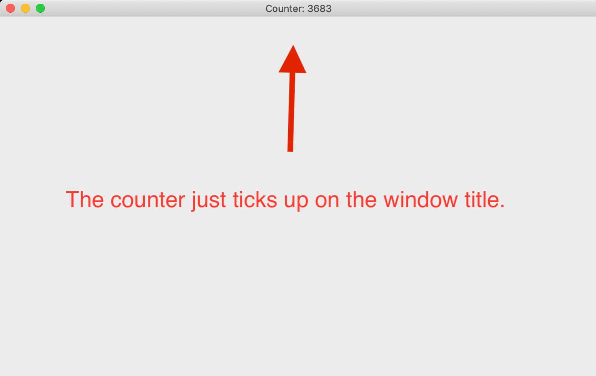

## Game Loop

A Rust crate that implements a frame-rate-independent game loop. The code is
based on ["Fix Your Timestep!"](https://gafferongames.com/post/fix_your_timestep/),
it's extremely lightweight and supports both native execution and compilation to
wasm.

## Usage

```rust
use game_loop::game_loop;

fn main() {
    let game = YourGame::new();

    game_loop(game, 240, 0.1, |g| {
        g.game.your_update_function();
    }, |g| {
        g.game.your_render_function();
    });
}
```

The value `240` is the number of updates per second. It is _not_ the frame rate.
In web environments, the frame rate is controlled by
[requestAnimationFrame](https://developer.mozilla.org/en-US/docs/Web/API/window/requestAnimationFrame),
otherwise render is called as quickly as possible, though you can slow it down
with [`std::thread::sleep`](https://doc.rust-lang.org/std/thread/fn.sleep.html)
if you wish. This may be useful if vsync is enabled or to save power on mobile
devices.

The value `0.1` is the maximum frame time which serves as an _escape hatch_ if
your functions can't keep up with 240 updates per second. Otherwise, your game
would 'death spiral' falling further and further behind. For example, if your
render function takes 0.5 seconds, only 24 updates would occur instead of 120.
This slows your game down but that's better than crashing.

The `g` closure argument lets you access your `game` state which can be anything
you like. You can also access the game loop's running time, how many updates
there have been, etc. It also provides a `blending_factor` that you may use in
your render function to interpolate frames and produce smoother animations. See
the article above for more explanation.

In web environments, requestAnimationFrame only runs when the browser tab is
active. Setting a maximum frame time ensures your game doesn't fall far behind
on its updates and is effectively paused. Also, `game_loop` is asynchronous and
returns immediately rather than blocking until `g.exit()` is called. Other than
that, the interface is exactly the same.

## Windowing

**New in version 0.6**

The crate now supports running a frame-rate independent game loop inside a
[winit](https://github.com/rust-windowing/winit) window. You can enable this
feature in your Cargo.toml:

```toml
[dependencies]
game_loop = { version = "*", features = ["window"] }
```

With this feature enabled, the interface is a little bit different:

```rust
use game_loop::game_loop;

use game_loop::winit::event::{Event, WindowEvent};
use game_loop::winit::event_loop::EventLoop;
use game_loop::winit::window::{Window, WindowBuilder};

fn main() {
    let event_loop = EventLoop::new();
    let window = WindowBuilder::new().build(&event_loop).unwrap();

    let game = YourGame::new();

    let g = game_loop(event_loop, window, game, 240, 0.1, |g| {
        g.game.your_update_function();
    }, |g| {
        g.game.your_render_function(&g.window);
    }, |g, event| {
        g.game.your_window_handler(event);
    });
}
```

Notably, the `game_loop` function now takes a winit
[`EventLoop`](https://docs.rs/winit/0.21.0/winit/event_loop/struct.EventLoop.html)
and [`Window`](https://docs.rs/winit/0.21.0/winit/window/struct.Window.html) and
an additional closure to handle window events such as resizing the window or
closing it. The window can be accessed through the `g` closure argument. This is
so you can bind a graphics context to it or set its title, etc.

Winit also supports wasm so in theory it should Just Work, but I haven't tested
it yet. Please refer to [winit documentation](https://github.com/rust-windowing/winit#platform-specific-usage)
for more information.

## Example 1: Game of Life

There's a [Game of Life example](./examples/game_of_life.rs) that shows how to
use the crate in its basic form, without wasm or windowing. You can run it with:

```sh
cargo run --example game_of_life
```


## Example 2: Using a Window

There's a [windowing example](./examples/using_a_window.rs) that shows how to
use the crate alongside a winit window. Youc an run it with:

```sh
cargo run --example using_a_window --features window
```



## License

MIT
