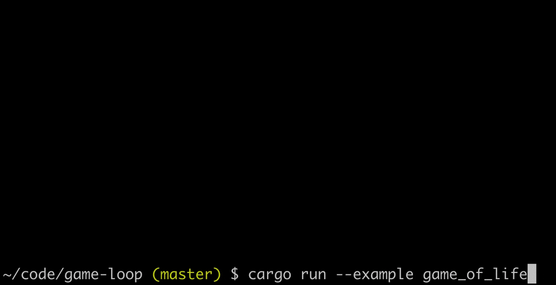
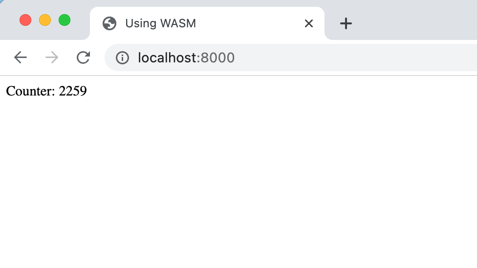
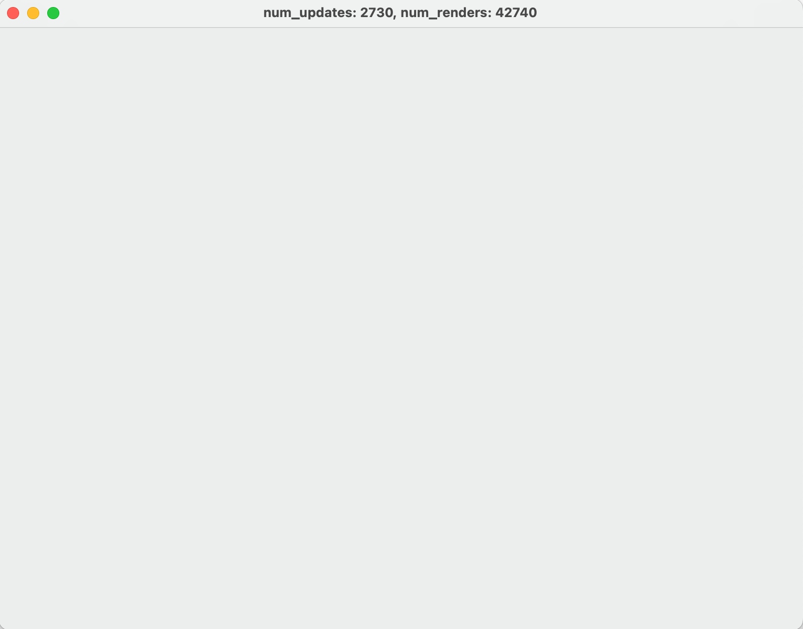
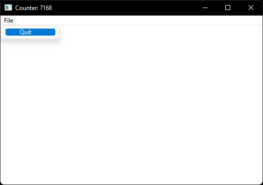

## Game Loop

A Rust crate that implements a frame-rate-independent game loop. The code is
based on ["Fix Your Timestep!"](https://gafferongames.com/post/fix_your_timestep/),
it's extremely lightweight and supports both native execution and compilation to
wasm.

## Usage

```rust
use game_loop::game_loop;

fn main() {
    let game = YourGame::new();

    game_loop(game, 240, 0.1, |g| {
        g.game.your_update_function();
    }, |g| {
        g.game.your_render_function();
    });
}
```

The value `240` is the number of updates per second. It is _not_ the frame rate.
In web environments, the frame rate is controlled by
[requestAnimationFrame](https://developer.mozilla.org/en-US/docs/Web/API/window/requestAnimationFrame),
otherwise render is called as quickly as possible.

The value `0.1` is the maximum frame time which serves as an _escape hatch_ if
your functions can't keep up with 240 updates per second. Otherwise, your game
would 'death spiral' falling further and further behind. For example, if your
render function takes 0.5 seconds, only 24 updates would occur instead of 120.
This slows your game down but that's better than crashing.

The `g` closure argument lets you access your `game` state which can be anything
you like. You can also access the game loop's running time, how many updates
there have been, etc. It also provides a `blending_factor` that you may use in
your render function to interpolate frames and produce smoother animations. See
the article above for more explanation.

By default, the amount of accumulated time since the last frame is measured
immediately before your render function is called. However, you can call
`g.re_accumulate()` right before you need to access `g.blending_factor()` for
more precise timings. This is useful if your render function does work before
it gets round to drawing, such as computing lighting.

In web environments, requestAnimationFrame only runs when the browser tab is
active. Setting a maximum frame time ensures your game doesn't fall far behind
on its updates and is effectively paused. Also, `game_loop` is asynchronous and
returns immediately rather than blocking until `g.exit()` is called. Other than
that, the interface is exactly the same.

## Windowing

The crate now supports running a frame-rate independent game loop inside a
[Winit](https://github.com/rust-windowing/winit) or
[TAO](https://github.com/tauri-apps/tao) window.
You can enable this in your Cargo.toml:

```toml
[dependencies]
game_loop = { version = "*", features = ["winit"] } # or tao
```

With one of these features enabled, the interface is a little bit different:

```rust
fn main() {
    let event_loop = EventLoop::new();

    let window = WindowBuilder::new().build(&event_loop).unwrap();
    let window = Arc::new(window);

    let game = YourGame::new();

    game_loop(event_loop, window, game, 240, 0.1, |g| {
        g.game.your_update_function();
    }, |g| {
        g.game.your_render_function(&g.window);
    }, |g, event| {
        g.game.your_window_handler(event);
    });
}
```

Notably, the `game_loop` function now takes `event_loop` and `window` arguments
and a third closure for handling window events such as resizing or closing. The
window can be accessed through the `g` closure argument. This is so you can
bind a graphics context to it or set its title, etc.

Winit also supports wasm so in theory it should Just Work, but I haven't tested
it. Please refer to [winit documentation](https://github.com/rust-windowing/winit#platform-specific-usage)
for more information.

## Example 1: Game of Life

There's a [Game of Life example](./examples/game_of_life.rs) that shows how to
use the crate in its basic form, without wasm or windowing. You can run it with:

```sh
cargo run --example game_of_life
```



## Example 2: Using WASM

There's a [wasm example](./examples/using_wasm/src/main.rs) that shows how to
use the crate in a web browser. You can run it with:

```sh
cd examples/using_wasm && ./run_example
```

Then open [localhost:8000](http://localhost:8000) in your web browser. The counters just tick up on the web page:



## Example 3: Using a Winit Window

There's a [Winit example](./examples/using_winit.rs) that shows how to
use the crate alongside a winit window. You can run it with:

```sh
cargo run --example using_winit --features winit
```

The counters just tick up on the window title:



## Example 4: Using a TAO Window

There's a [TAO example](./examples/using_tao.rs) that shows how to use the
crate alongside a TAO window with a native menu bar. You can run it with:

```sh
cargo run --example using_tao --features tao
```

The counters just tick up on the window title:



## License

MIT
